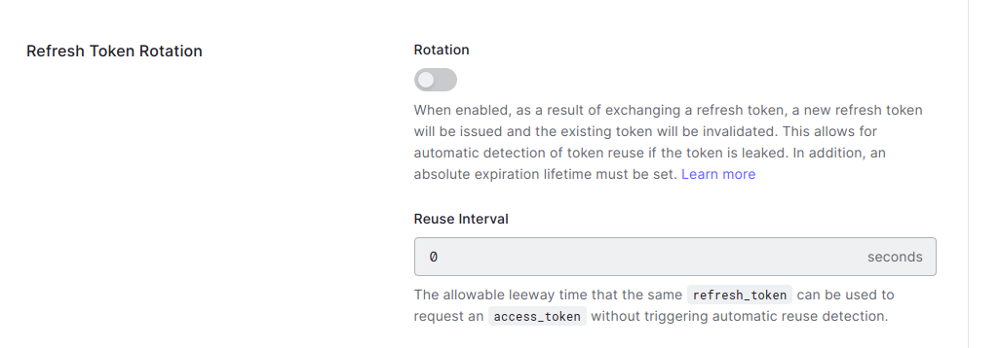

# SaaS template to bootstrap your business

## What is this?

This is a template for a SaaS application that includes:

- Multi tenant
- Authentication with Auth0
- Billing with Stripe

## What else is included?

- Documentation pages
- Landing page
- Pricing page
- Dashboard panel

# Parameters

# Setup Stripe

You need an active account in stripe and download the CLI.

If you don't have an account you can [sign up here](https://dashboard.stripe.com/register)

## Install CLI

The instructions to install and set up the CLI can be found [on the documentation of Stripe](https://stripe.com/docs/stripe-cli#install)

Once installed you'll need to log in:

```bash
stripe login
```

## Create prices

The following command will create the needed plans, the .env.local.example has already the plans configured.

```bash
stripe fixtures ./fixtures/plans.json
```

## Listen to webhooks

In order to synchronize the subscription id with the tenant, webhooks for local development need to be configured:

```bash
stripe listen --forward-to=localhost:3000/api/stripe/webhook
```

This command will print out a webhook secret key, this needs to be included in the .env.local as _STRIPE_WEBHOOK_SECRET_

# Setup Auth0

If you don't have an account, you can [sign up here](https://auth0.com/signup?place=header&type=button&text=sign%20up)

You need an active account in auth0, create a tenant and download the CLI.
After that you'll need to log in:
```bash
auth0 login # press enter 
```

## Install CLI
The instructions to install and set up the Auth0 CLI can be found [on the auth0-cli documentation](https://github.com/auth0/auth0-cli#installation)

Documentation about the CLI can be found [on this webpage from Auth0](https://auth0.github.io/auth0-cli/)

## Setup Web client

```bash
auth0 apps create --name=web --type=spa --callbacks=http://localhost:3000/dashboard,http://localhost:3000 \
    --description=saas \
    --logout-urls=http://localhost:3000 \
    --web-origins=http://localhost:3000 \
    --origins=http://localhost:3000
```

Take the CLIENT_ID value and assign it to NEXT_PUBLIC_AUTH0_CLIENT_ID in the .env.local file.

To ensure that your client is working, execute the following command:

```bash
auth0 test login <CLIENT_ID>
```

For the refresh token to work, disable rotation in the Auth0 dashboard:



## Setup management client (optional)

Management client is needed in order to add/remove tenant members, and the only permission needed is to read the users by email.

```bash
auth0 apps create --name=mgmt --type=m2m --description=mgmt
```

### Get the ID of the management API

```bash
auth0 apis ls
```

Take the id and replace it by <APP_MGMT_ID>.

```bash
auth0 apis open "<APP_MGMT_ID>"
```

Go to "Machine to Machine Applications" tab and authorize the application mgmt, then click the arrow and in the permissions, select the following items:

- "read:users"

Then get the client id and client secret of the mgmt client, and replace the following values in .env.example:

- AUTH0_CLIENT_ID
- AUTH0_CLIENT_SECRET
